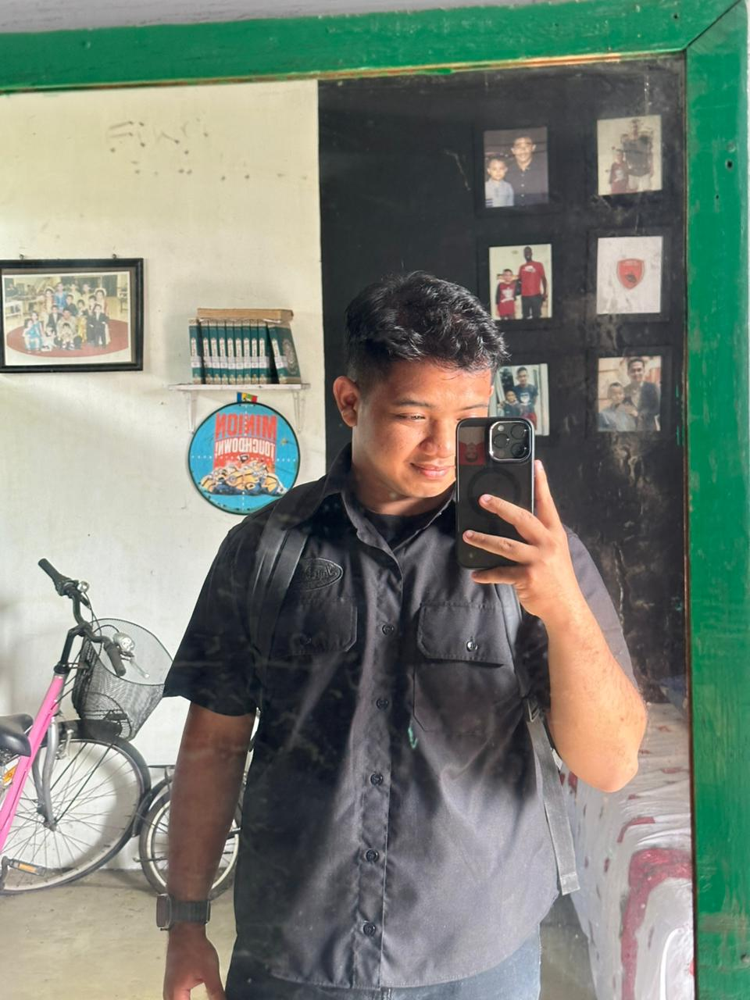

  

  <h1 align="center">Hai, Saya Muhammad Akbar! 👋</h1>

  

    <b>Student | Web Developer | Microcontroller Enthusiast</b>
  

  
  

    Selamat datang di repositori portofolio pribadi saya.
     
    <i>"Building bridges between Software and Hardware."</i>
  

  

    
    
    
  

---

## 👨‍💻 Tentang Saya

Halo! Saya **Muhammad Akbar**, seorang mahasiswa yang memiliki ketertarikan mendalam pada pengembangan teknologi, mulai dari perangkat lunak hingga perangkat keras.

Fokus utama saya saat ini adalah **Web Development**. Saya senang membangun aplikasi web yang dinamis serta bereksperimen dengan mikrokontroler untuk menciptakan solusi IoT sederhana.

Saat ini saya sedang mendalami:

- **Web Programming:** Membangun sistem yang fungsional (seperti aplikasi manajemen catatan & website profil).
- **Hardware/IoT:** Merancang sirkuit dan logika untuk mikrokontroler (8051, ESP32, Arduino).
- **Algorithm:** Mempelajari efisiensi kode dan struktur data (Sorting & Searching).

---

## 🛠️ Keahlian & Teknologi

Berikut adalah teknologi yang sering saya gunakan dalam proyek-proyek saya:

### 💻 Languages & Frameworks

### 🔌 Hardware & Embedded

### 🗄️ Database & Tools

---

## 📂 Portofolio Proyek Terpilih

Berikut adalah beberapa proyek yang pernah saya kerjakan:

### 1. Website Brand "Iyra.id" 🍜

Sebuah landing page untuk brand makanan yang dirancang menggunakan HTML & CSS murni. Fokus pada tampilan visual yang menarik dan branding yang kuat.

### 2. Aplikasi Diary/Notes (CRUD) 📝

Aplikasi web berbasis **PHP Native** dan **MySQL** yang memungkinkan pengguna untuk menulis, menyimpan, mengedit, dan menghapus catatan harian pribadi secara aman.

### 3. Prototipe Lampu Lalu Lintas (8051) 🚦

Simulasi sistem kontrol lalu lintas berbasis mikrokontroler MCS-51 (8051). Proyek ini mencakup perancangan diagram sirkuit dan pemrograman logika assembly/C untuk mengatur timing lampu secara otomatis.

### 4. Sistem Pakar (Expert System) 🤖

Implementasi metode _Forward Chaining_ dan _Backward Chaining_ untuk menyelesaikan permasalahan logika berbasis aturan (Rule-based system).

---

## 📈 Statistik GitHub Saya

  
  

---

## 📫 Kontak

Terbuka untuk diskusi mengenai proyek web, kolaborasi mikrokontroler, atau sekadar bertukar pikiran tentang teknologi!

- **Lokasi:** Kab, Gowa , sulawesi selatan, Indonesia
- **Email:** muhammadakbar032005@gmail.com

---

  <small>Terima kasih telah berkunjung! ⭐ Jangan lupa beri bintang jika Anda menyukai repo ini.</small>

